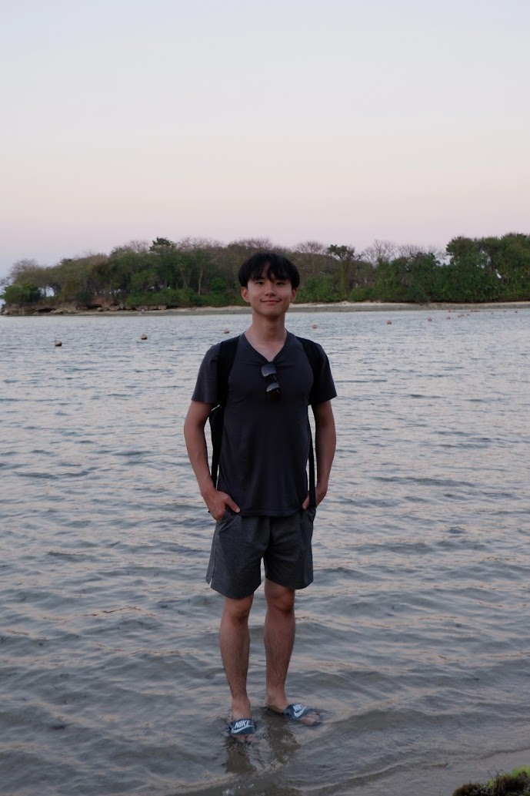

{width=250px}  
\n
I'm from Hong Kong and I studied my BSc in Geomatics at the Hong Kong Polytechnic Uiversity. After graduating, I worked in civil engineering for 2 years and then move to greater Vancouver. After that I have been working in a Land Surveying & Civil Engineering Firm for another 2 years. However I truly love Data Science and Artificial Intelligence. Not only I did a thesis in applying deep learning in remote sensing to analyze the aftermaths of wars but also had a lot of side projects ranging to spatial data science to algorithmic trading. Though this program, I hope I can advance my skills in data engineering and also the algorithms in ML. I hope I could be a Data Scientist / MLE in the future!

This is a Quarto website.

To learn more about Quarto websites visit <https://quarto.org/docs/websites>.
